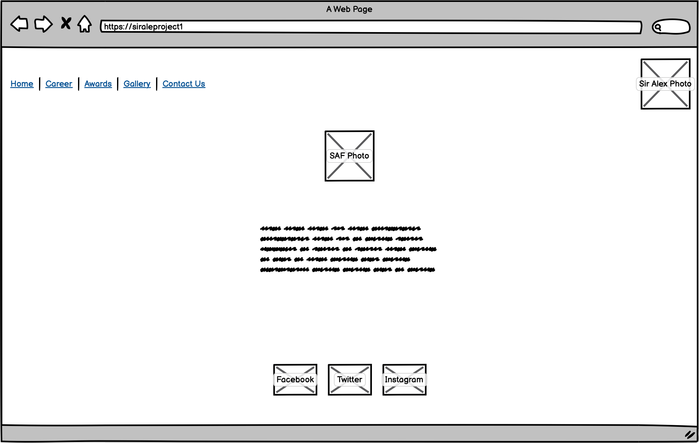
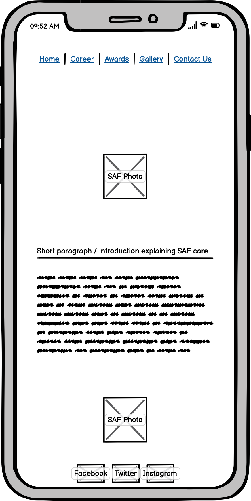
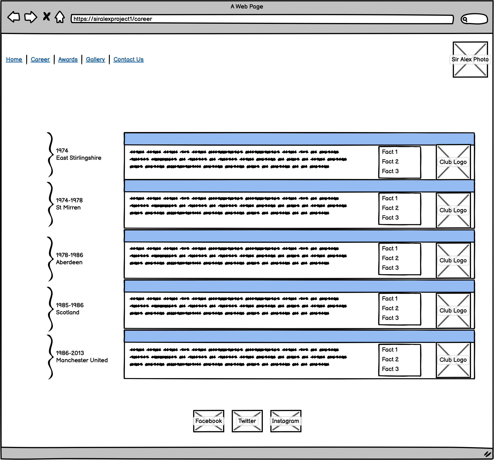
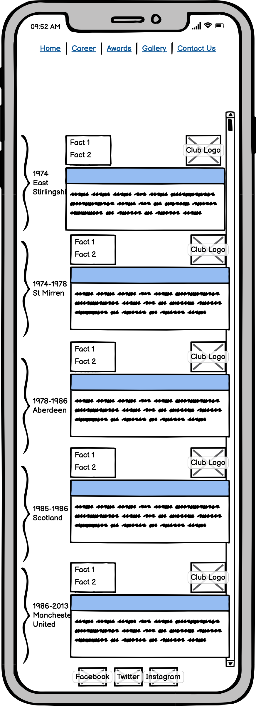
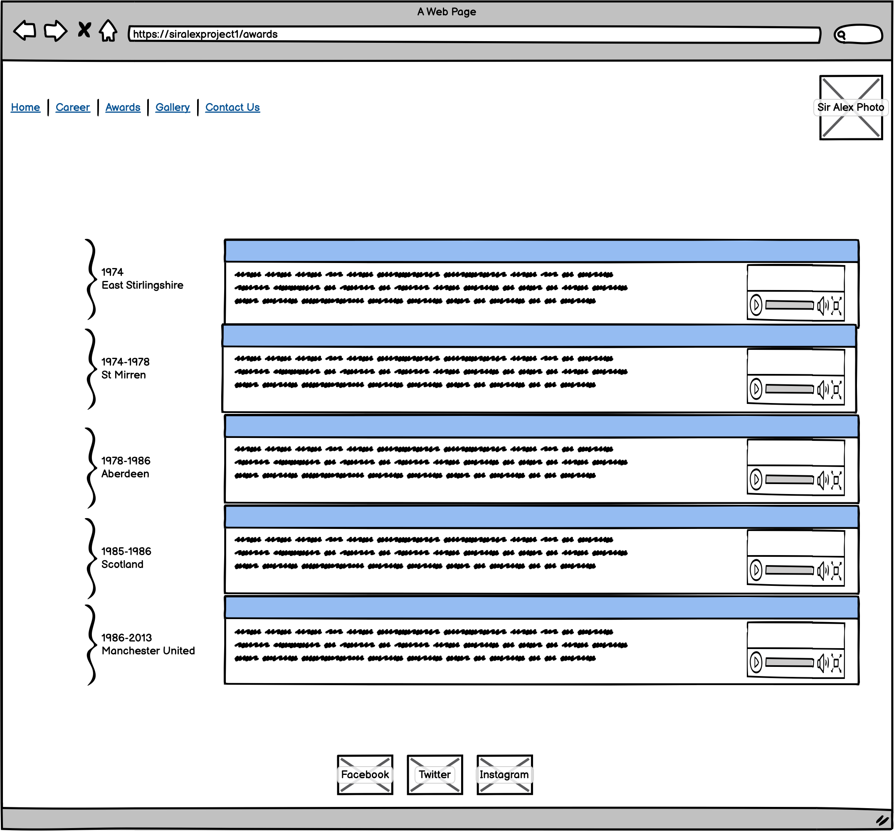
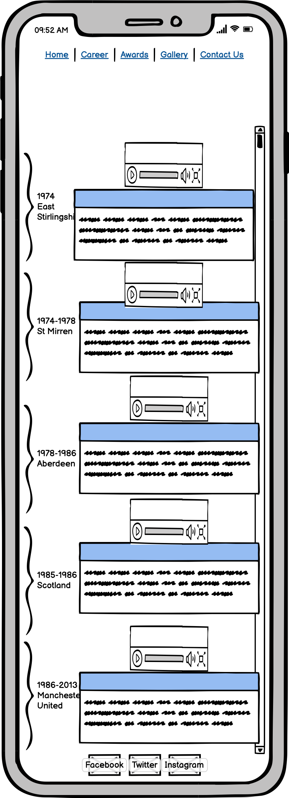
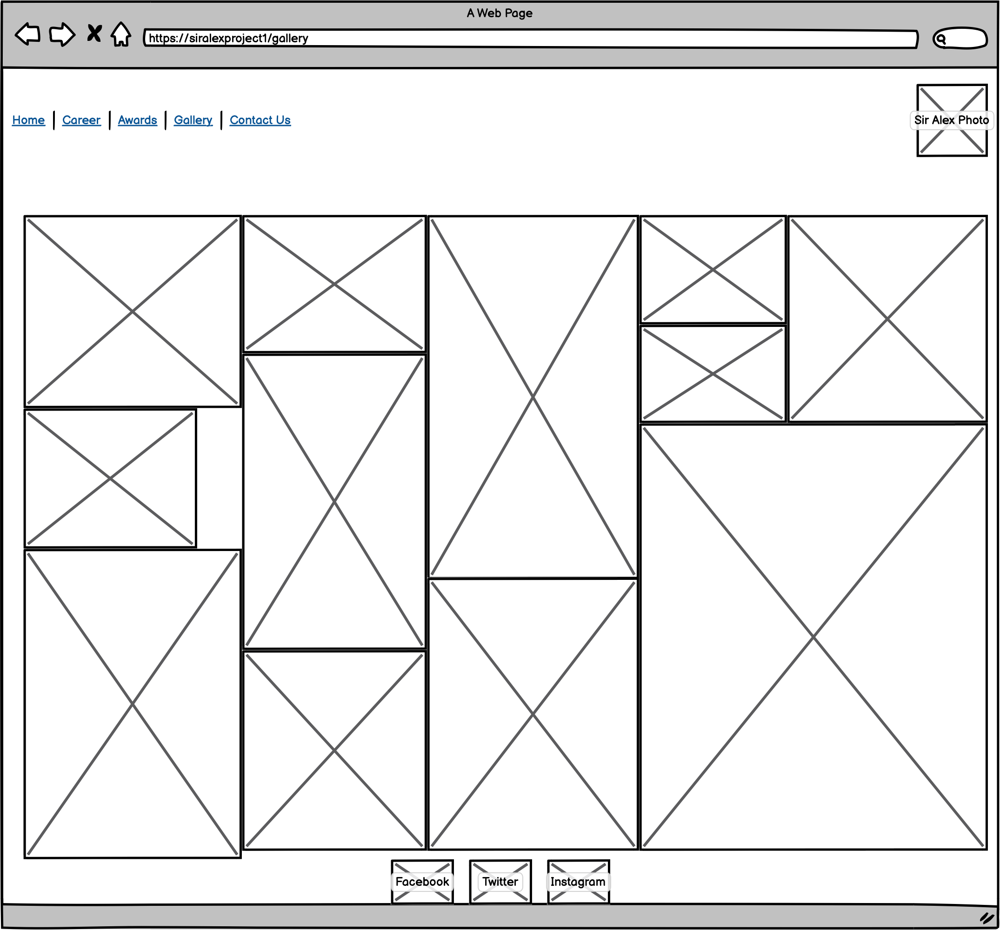
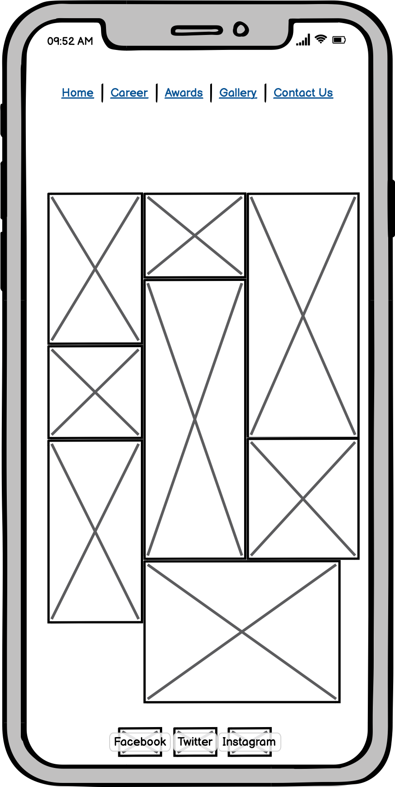
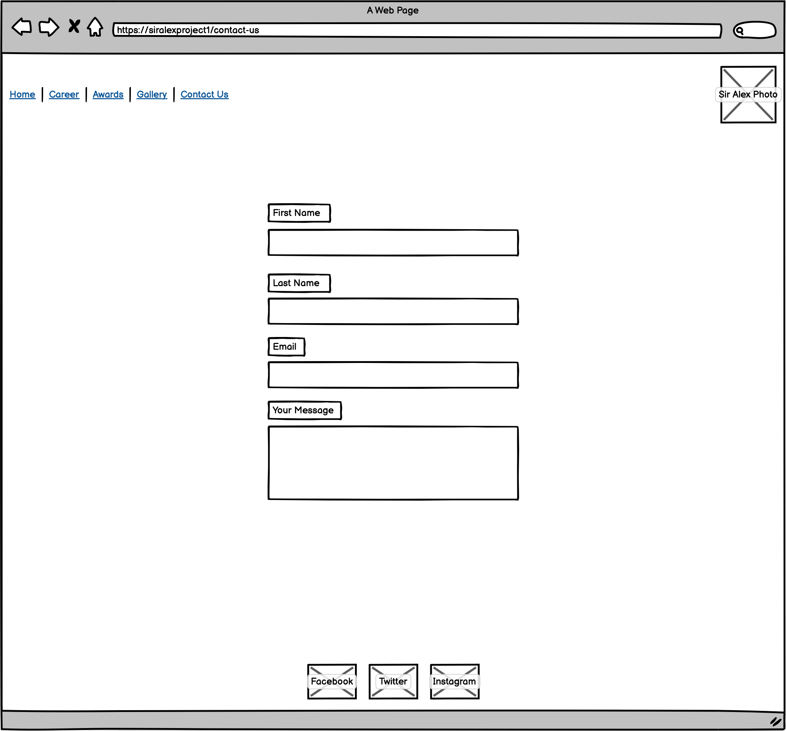
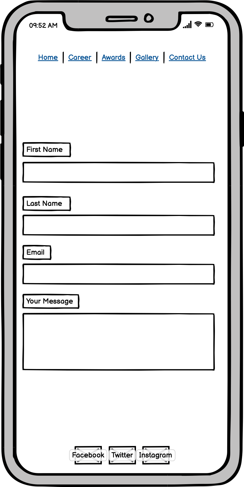

# Sir Alex Ferguson History Website

## Introduction

Welcome to my first project. This project is a history website based on Sir Alex Ferguson, many consider him to be the best football manager of all time. This website shows you why he is the one of if not the greatest football managers of all time. You will find many stats and facts about managerial.

A live website can be found [here](git-hub-pages-link)

# Table of Contents
- [UX](#ux)
  * [Strategy](#strategy)
    + [Project Goals](#project-goals)
      - [User Goals:](#user-goals)
      - [User Expectations:](#user-expectations)
      - [Trends of Modern Websites](#trends-of-modern-websites)
      - [Strategy Table](#strategy-table)
  * [Structure](#structure)
  * [Skeleton](#skeleton)
  * [Surface](#surface)
- [Features](#features)
    + [Existing Features](#existing-features)
    + [Features Left to Implement](#features-left-to-implement)
- [Technologies Used](#technologies-used)
- [Testing](#testing)
- [Development Cycle](#development-cycle)
- [Known Bugs](#known-bugs)
- [Deployment](#deployment)
- [Credits](#credits)
# UX

As a big football and Manchester United fan, I have always seen articles on why Sir Alex Ferguson is the greatest manager ever. However, I have not come across of a dedicated website to showcase his whole career.

This project will showcase statistics and facts that proves that his legacy was one of the greatest of all time.

## Strategy

### Project Goals

The main goal for this website is show more awareness of this man. I want to teach the target audience of why he is rated so highly by his peers and colleagues.

### User Goals:
 * First Time Visitor Goals
    - As a First Time Visitor, I want to learn about the history of this person and understand why he was rated so highly.

    - As a First Time Visitor, I want to be able to easily navigate throughout the site to find content.

    - As a First Time Visitor, I want to look for statistics and facts to tell my why he's proven to be the greatest of all time.

 * Returning Visitor Goals

    - As a Returning Visitor, I want to find information about Sir Alex Ferguson.

    - As a Returning Visitor, I want to find the best way to get in contact the organisation with any questions I may have.

* Frequent User Goals

    - As a Frequent User, I want to check to see if there are any newly added stats and facts.

    - As a Frequent User, I want to check to see if another manager will be rated as highly.

### User Expectations:
The content should prove why Sir Alex Ferguson is the greatest manager.
- The content is displayed in a clear and understanding format.
- The user interface is easy to navigate.
- The website is responsive on all devices this includes mobile, table and desktop.
- To have the ability to contact the creator of the website.

### Trends of modern websites:
- Multimedia experiences
- Offering Audio
- Consistency of design
- Easy on the eye colour pallets
- Dark Mode

### Strategy Table
Opportunity/Problem/Feature| Importance| Viability/Feasibility
------------ | -------------------------|---------
Increase awareness | 5 | 5
Educational content | 5| 5
Highlight achievements | 5 | 5
Responsive design | 5 | 5
Contact me form | 4 | 5
Career history | 5 | 5
Testimonials | 5 | 5
Honourable mentions | 3 | 2
Dark mode | 4 | 1
Total | 41 | 38

## Scope

As I unable to include all of the features from the strategy table. I will phase this project in multiple phases. Phase 1 will be what i have identified as a minimum viable product. Please find below the plans i have for each phase.

### Phase 1
- Add educational content
- Highlight his achievements
- Responsive design
- Increase awareness
- Contact me form
- Career history
- Testimonials

### Phase 2
- Dark Mode
- Honourable mentions

## Structure

It is really important to include responsive design in this project as many users are using different devices (mobile, tablet, laptop/PC). This gives the user the best experience on their device.

 - Responsive on all devices sizes
 - Navigation bar that is placed on the top left of the screen and is clear and easy to use. This is also placed in the    same position on every page.
 - Footer at the bottom of each page that links to the social media websites.
 - All elements will be consistent including font size, font family, colour scheme.

## Skeleton

I used [Balsamiq](https://balsamiq.com/) to create my wireframes as this gives the template of the UI. This also shows where all elements will placed within the screen.

There are 2 versions of each wireframe as one shows the design on a web browser and the other shows a mobile browser format.

### Wire-frames
Web browser home page

Mobile browser home page

Web browser career page

Mobile browser career page

Web browser awards page

Mobile browser awards page

Web browser gallery page

Mobile browser gallery page

Web browser gallery page

Mobile browser gallery page

## Surface

### Colours
Please find the colours schemes that i used [here](https://coolors.co/34495e-ffffff-e74c3c-3a3a3a-fafafa).

### Typography
I decided to use Roboto as my font of choice with sans serf as my backup font for browsers that might not support Roboto.

# Features

### All pages:
- Navigation bar is place at the top of the screen, for ease of use and consistency. It has a hover effect and changes colour to improve user experience. The page that you have selected also highlights red so the user knows exactly which page they are on.
- Social media links, - all links are placed at the bottom of each page in the footer. All links open in a new tab.
- Logo/text - a Sir Alex Ferguson logo is also placed on the top right of each page. This give the context that the website is about him.

### Landing page:
- Main image - a large image that shows who the website is about.
- Summary - a short summary of what Sir Alex achieved.
- Video - an embedded tribute video from youtube that gives the user the multi media experience. This helps the user to be engaged with the website.

### Career page:
- Overall statistics - a small bordered box that shows the his managerial career stats.
- Timeline - this element shows his career in a chronological experience. Reading from the top (when he started his career) to the bottom (when he finishes his career). This section tells you which clubs he has managed and a short summary of what he achieved.
- Club logos - These images add a visual to UI and improving UX as its not just text on the page.

### Testimonials page:
- Card style view - this gives the user an easy to read card view that breaks information down to small sections. The user can read from card to card.
- Card images - all images are of the same size, giving the UI consistency. This also gives context of who the quote was from.
- Card quotes - short quotes about Sir Alex admiring him. These quotes are from players who played under him and other managers giving credit.

### Gallery page:
- Collage images - these images are placed in a collage design. This allows me to place multiple sized images to the given screen size. The images show the success and happiness he had in the game.

### Contact page:
- Contact form - this gives the user the ability to message me for any issues they are having with the site, any suggestions of improvement and and to give their opinions on any other manager that could potentially take his place.

## Technologies Used

* [HTML5](https://en.wikipedia.org/wiki/HTML)
  * The project uses Hyper Text Markup Language.
* [CSS3](https://en.wikipedia.org/wiki/CSS)
  * The project uses Cascading Style Sheets.
* [Atom](https://atom.io/)
  - The project uses Atom to code.
* [Chrome](https://www.google.com/intl/en_uk/chrome/)
  - The project uses Chrome to debug and test the source code using HTML5.
* [Balsamiq](https://balsamiq.com/)
  - Balsamiq was used to create the wireframes during the design process.
* [Google Fonts](https://fonts.google.com/)
  - Google fonts were used to import "Roboto" font into the style.css file which is used on all pages throughout the project.
* [GitHub](https://github.com/)
  - GitHub is used to store the projects code after being pushed from Git.

# Testing

## Automated testing
### Google Developer Tools

Every element that i added to my html, i would add the basic CSS in to my stylesheet. I would then use the inspect element to try different styles. Once i've got it to my liking i would copy the CSS from google into my stylesheet. This allows to keep track of the code i am using.

### Responsive Tools

I used [Am I Responsive](http://ami.responsivedesign.is/) to make sure that all my pages are responsive to all devices.

### W3C Validator Tools

I used [W3C Markup](https://validator.w3.org/#validate_by_input+with_options) to check for any errors within my HTML pages.

I had an error on the index.html page with the iframe attribute of "frameborder". The HTML checker notified me that this attribute is obsolete and to use CSS instead.

I also had an error on contact_us.html page with a duplicate ID of "form_inline". I rectified this by changing the ID's to a class instead and updated the CSS for this.

I used [W3C CSS Validation](https://jigsaw.w3.org/css-validator/) to check for any error within my CSS stylesheet.

## Manual Testing

I have tested my site on Safari and google chrome on multiple devices.

These include:
  - iPhone X
  - iPhone XS Max
  - iPad Pro
  - Macbook Pro

# Development Cycle
There were many elements i changed, re-positioned and added from my original wireframes as they were more visually appealing.

### All pages:
 - Replaced the Sir Alex Photo on the top right with just a text. This is visually more appealing because the text can fit inside the navigation bar.

### Landing page:
  - The original wireframe lacked attention from users. I added an embedded YouTube video to make the user more variety with different media elements. This video is also a short introduction of what the website is about.

### Career page:
  - I added a in a statistics panel to show the numbers Sir Alex achieved during his career.
  - The original design shows the timeline is continuously on the left side of the page. I decided to change this to make the timeline appear on the centre of the page with the content displaying on left then right side of the page. This keeps the user engaged as the content isn't just a blocks of text.

### Testimonials page:
  - The original wireframe shows this page as an awards page with the same timeline design as the career page however, i changed this to a testimonials page. This is to give the user a better experience with a different format from the career page. As i was planning to use the same design the user would have been less engaged as they felt like they were reading the same content in the same format.
  - I added in a cards view, this gives the user smaller amounts of content so its easy to process. The image on each card also gives context of who the quote was from.

### Gallery page:
  - The gallery page has remained the same. I added a hover animation over each photo to give context of what the image is about.

### Contact page:
 - After coding the contact page to the original design. I thought that is looked dull, so i added in other elements to make this page visually appealing to the users.
 - Added google maps location
 - Added icons for location, telephone number and contact email.

# Known Bugs
  - On some mobile devices the navigation bar pushes down on two lines

# Deployment

I used GitHub pages to deploy this project.

(OL how to do this)

## Credits

### Code
 * The navigation bar code came from [Code Pen](https://codepen.io/puskuruk/pen/bGbexXd)
 * The cards view on the index.html was inspired from [Code Pen](https://codepen.io/mcraiganthony/pen/NxGxqm)
 * The timeline feature on the career.html and awards.html page was inspired from [W3Schools](https://www.w3schools.com/howto/howto_css_timeline.asp)
 * The footer code came from the Love Running projects
 * The collage design was inspired by [W3Schools](https://www.w3schools.com/howto/tryit.asp?filename=tryhow_css_image_grid_responsive)
 * The gallery page has a hover effect on the image the code came from [W3Schools](https://www.w3schools.com/howto/tryit.asp?filename=tryhow_css_image_overlay_opacity)

### Content
 * All quotes on the index.html page came from [Planet Football](https://www.planetfootball.com/quick-reads/19-of-the-best-quotes-about-sir-alex-ferguson-such-an-iconic-person/)
 * The timeline content on the career.html page came from [Wikipedia](https://en.wikipedia.org/wiki/Alex_Ferguson)
 * All images came from [Google Images](https://www.google.com/imghp?hl=en)
